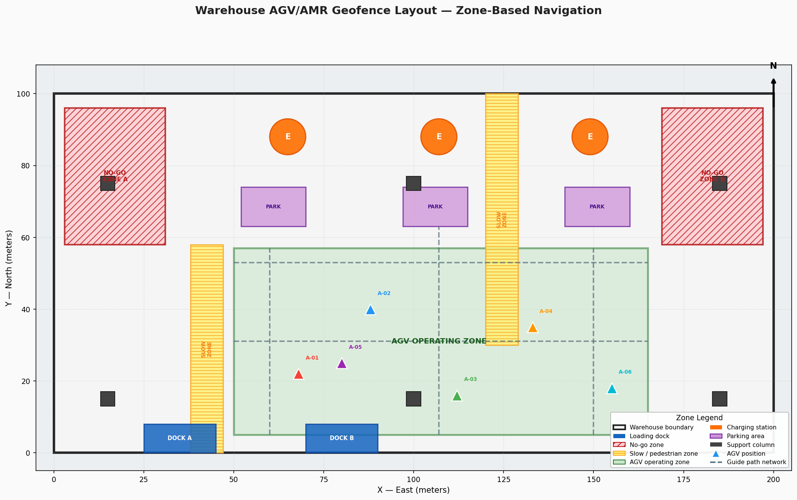
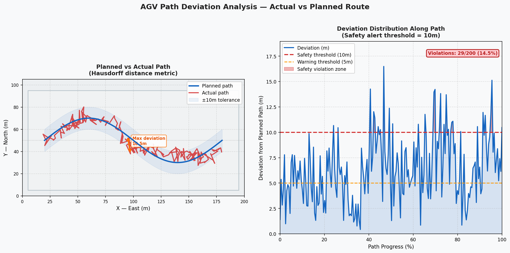
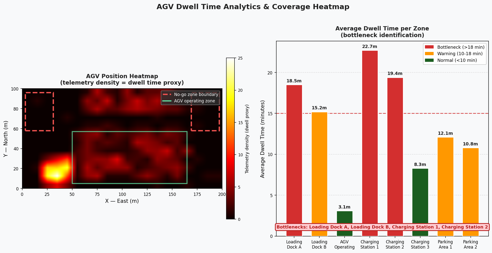

# AGV/AMR Geofencing & Geospatial Warehouse Management
### Author: Emmanuel Oyekanlu — Principal AI/Data Solutions Engineer

---

## Visual Gallery

The images below are generated directly from this repository's code using only `matplotlib` and `numpy`, reproducing the geospatial patterns built at Corning Inc.

### Warehouse Geofence Layout
Full 200m × 100m warehouse map with Shapely polygons: no-go zones (red hatched), slow/pedestrian zones (yellow), AGV operating zone (green), charging stations, parking areas, guide path network, and live AGV fleet positions.



### Path Deviation Analysis
Left: planned vs actual AGV path with Hausdorff distance arrow at worst deviation point. Right: deviation distribution along the path with safety (10m) and warning (5m) thresholds highlighted.



### Zone Dwell-Time Heatmap & Analytics
Left: 2D telemetry density heatmap (proxy for dwell time) overlaid on zone outlines. Right: per-zone average dwell time bar chart with bottleneck identification (> 15 min threshold).



---

## Background: Real-World Context at Corning Inc.

During my tenure as a Principal Data Engineer at Corning Inc., one of my most technically challenging responsibilities involved building the geospatial data infrastructure for our Automated Guided Vehicle (AGV) and Autonomous Mobile Robot (AMR) fleet management system. Corning operates large manufacturing and warehouse facilities where precision routing, collision avoidance, and real-time zone enforcement are safety-critical requirements.

This repository demonstrates the geospatial engineering techniques I applied to solve these problems using open-source Python tools: **GeoPandas**, **Shapely**, and **GeoJSON**.

---

## What Are AGVs and AMRs?

- **AGV (Automated Guided Vehicle)**: Follows fixed physical paths (magnetic tape, wire, or optical tracks). Common in warehouses for repetitive transport tasks.
- **AMR (Autonomous Mobile Robot)**: Uses onboard sensors (LiDAR, cameras) to navigate dynamically. Can re-route around obstacles in real time.

At Corning, our fleet included both types — AGVs for fixed pallet transport lanes and AMRs for flexible picking operations in dynamic areas.

---

## The Geofencing Challenge

A **geofence** is a virtual geographic boundary defined as a polygon in coordinate space. In a warehouse context:

1. **Operational zones** define where robots are permitted to travel and at what speed
2. **No-go zones** protect workers and sensitive machinery
3. **Slow zones** enforce reduced speed near pedestrian crossings
4. **Charging stations** must be accessible only to robots with low battery
5. **Loading dock zones** coordinate entry/exit timing with external trucks

Without a robust geospatial layer, zone enforcement relied on hardcoded coordinate thresholds — brittle, hard to maintain, and impossible to visualize. By migrating to a proper GeoDataFrame architecture with Shapely polygons, we achieved:

- **Declarative zone configuration** via GeoJSON files (editable without code changes)
- **Spatial join–based zone lookup** replacing O(n) threshold checks
- **Path deviation detection** using Hausdorff distance metrics
- **Dwell-time analytics** to identify bottleneck zones
- **Visual audit capability** for safety compliance reviews

---

## Repository Structure

```
07_agv_amr_geofencing_geospatial/
├── README.md                          # This file
├── requirements.txt                   # Python dependencies
├── .gitignore
├── 01_warehouse_map_creation.py       # Build warehouse boundary + structural features
├── 02_geofence_zone_definition.py     # Define operational zones as polygons
├── 03_agv_path_network.py             # Define guide path network as LineStrings
├── 04_position_zone_checker.py        # Real-time zone membership for AGV positions
├── 05_path_vs_planned_analysis.py     # Deviation analysis: actual vs planned path
├── 06_dwell_time_and_coverage.py      # Dwell time analytics + coverage heat map
└── data/
    ├── warehouse_layout.geojson       # Warehouse boundary + structural features
    ├── agv_zones.geojson              # Operational zone polygons
    └── path_network.geojson           # Path network LineStrings
```

---

## Script Descriptions

### `01_warehouse_map_creation.py`
Defines the warehouse as a 200m × 100m rectangular polygon in a local Cartesian CRS (EPSG:32617 — UTM Zone 17N, appropriate for Corning, NY). Adds structural features:
- **4 support columns** (1m × 1m squares) at interior positions
- **2 loading docks** (6m × 4m rectangles) cut into the south wall
- **1 fire exit zone** (emergency buffer polygon on east wall)

Exports a complete `warehouse_layout.geojson` and produces a labeled plot.

### `02_geofence_zone_definition.py`
Defines all operational zones within the warehouse footprint:
- `agv_operating_zone` — main travel corridor
- `charging_station` (×2) — designated battery recharge areas
- `no_go_zone` — active machinery, hazardous equipment
- `slow_zone` (×3) — pedestrian crossing areas at 0.5 m/s
- `parking_area` (×2) — robot staging/waiting areas
- `loading_dock_zone` — coordination buffer at loading docks

Each zone carries metadata: `speed_limit_mps`, `priority`, `zone_type`. Exported as `agv_zones.geojson` and plotted color-coded.

### `03_agv_path_network.py`
Models the physical guide path network as a GeoDataFrame of LineString segments:
- **Main aisles** (north-south and east-west arterials)
- **Cross aisles** connecting primary routes
- **Approach paths** to charging stations and loading docks

Each segment records: `path_id`, `direction` (one_way/bidirectional), `max_speed_mps`. Demonstrates a spatial intersection query to find which zones each path segment passes through.

### `04_position_zone_checker.py`
Simulates 50 AGV telemetry readings (timestamp, agv_id, x, y coordinates). Uses `gpd.sjoin()` (spatial join) to determine which zone each position falls within. Flags any positions in `no_go_zone` as safety violations. Produces a summary report with violation counts per AGV.

**This is the core real-time geofencing logic** — in production at Corning this ran as a streaming consumer reading from a Kafka topic of robot telemetry events.

### `05_path_vs_planned_analysis.py`
Given a planned reference path and an actual traveled path (reconstructed from position log), computes:
- **Hausdorff distance**: maximum deviation between actual and planned routes
- **Fréchet distance approximation**: ordered path similarity
- **Buffer tolerance check**: what percentage of actual positions fall within ±0.5m of planned path
- Generates a textual analysis report

### `06_dwell_time_and_coverage.py`
From the simulated position log, computes:
- Time each AGV spent in each zone (dwell time analysis)
- Warehouse coverage heat map (100 × 50 grid cells, 2m resolution)
- Identification of bottleneck zones (highest average dwell time)
- Summary statistics table and matplotlib heat map visualization

---

## Coordinate Reference System Notes

All warehouse geometry uses **EPSG:32617** (WGS 84 / UTM Zone 17N) for metric precision. For warehouses in other geographic locations, substitute the appropriate UTM zone. All GeoJSON export uses WGS84 (EPSG:4326) per the GeoJSON specification (RFC 7946).

---

## Installation

```bash
pip install -r requirements.txt
```

## Running the Scripts

Run in order — each script may depend on GeoJSON files produced by earlier scripts:

```bash
python 01_warehouse_map_creation.py
python 02_geofence_zone_definition.py
python 03_agv_path_network.py
python 04_position_zone_checker.py
python 05_path_vs_planned_analysis.py
python 06_dwell_time_and_coverage.py
```

---

## Connection to Production Systems

In the production deployment at Corning:
- Zone GeoJSON files were stored in a versioned S3 bucket (treated as geospatial configuration)
- Zone lookup ran as a Python microservice reading robot telemetry from **Apache Kafka**
- Dwell-time metrics were written to a **Delta Lake** table via **Apache Spark**
- Daily zone violation reports were generated by an **Apache Airflow** DAG
- The warehouse map was rendered in a React dashboard using **Leaflet.js**

This repository demonstrates the foundational geospatial layer that made all of that possible.

---

## Key Libraries

| Library | Purpose |
|---------|---------|
| `geopandas` | GeoDataFrame operations, spatial joins, I/O |
| `shapely` | Geometry creation (Polygon, LineString, Point) |
| `fiona` | Low-level GeoJSON/Shapefile I/O |
| `matplotlib` | Static map visualization |
| `numpy` | Coordinate array generation |
| `pandas` | Tabular data operations |
| `geojson` | GeoJSON serialization utilities |

---

*Emmanuel Oyekanlu — Principal AI/Data Solutions Engineer*
